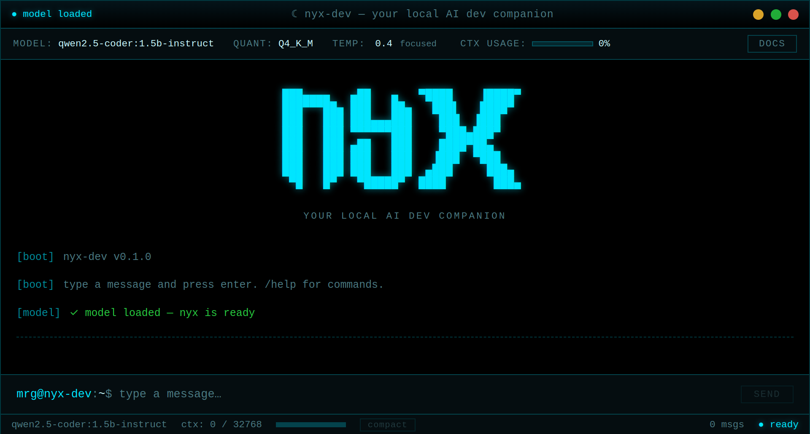

# nyx-dev



Your local AI dev companion. A terminal-style desktop app that runs a local LLM (Qwen2.5-Coder 1.5B) entirely on your machine — no API keys, no cloud, no telemetry.

## Features

- **Local LLM** — runs Qwen2.5-Coder 1.5B via llama.cpp, fully offline
- **DevDocs browser** — browse official docs side-by-side with the AI
- **Code highlighting** — syntax highlighting for 17+ languages

## Download

Grab the latest release from [Releases](https://github.com/mrgonzales-dev/nyx-buddy/releases):

- **Windows**: `nyx-buddy Setup x.x.x.exe`
- **Linux**: `nyx-buddy-x.x.x.AppImage`

The GGUF model (~1.1 GB) downloads automatically on first launch.

## Requirements

| | Minimum | Recommended |
|---|---|---|
| RAM | 4 GB | 8 GB |
| CPU | x86_64, 2 cores | 4+ cores, AVX2 |
| Disk | 1.5 GB free | 2 GB free |
| OS | Windows 10 / Ubuntu 18.04 / macOS 10.15 | Windows 11 / Ubuntu 22.04 / macOS 12+ |

No GPU required. The 1.5B model runs on CPU.

## Dev setup

```bash
git clone https://github.com/mrgonzales-dev/nyx-buddy.git
cd nyx-buddy
npm install
```

Place the GGUF model at `resources/models/qwen2.5-coder-1.5b-instruct-q4_k_m.gguf` (download from the [model release](https://github.com/mrgonzales-dev/nyx-buddy/releases/tag/model)).

```bash
npm run electron:dev
```

## Build

```bash
npm run dist:win     # Windows installer
npm run dist:linux   # Linux AppImage
```

## Tech stack

- **Electron** — desktop shell
- **Vue 3 + Vite** — frontend
- **node-llama-cpp** — local LLM inference (llama.cpp bindings)
- **Qwen2.5-Coder 1.5B Instruct (Q4_K_M)** — the model (Apache 2.0)
- **markdown-it + highlight.js** — markdown rendering

## License

MIT
